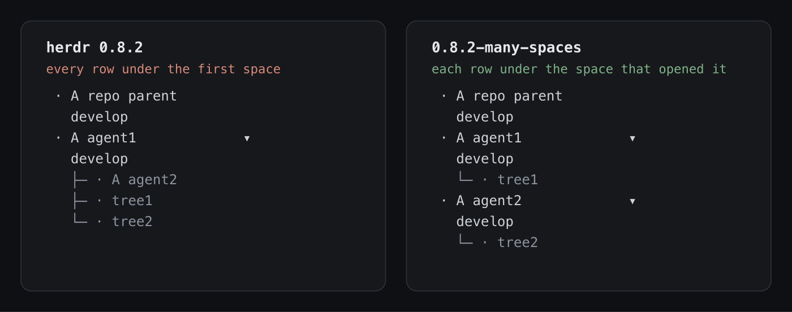

# herdr-many-spaces

A fork of [herdr](https://github.com/herdrdev/herdr) that changes one thing: **a
worktree row belongs to the space that opened it.**

<p align="center">
  
</p>

Both halves of that picture are the same session snapshot, drawn by the two
binaries. Upstream identifies a group by repository and order alone: the first
space holding a repository becomes the parent, and everything else on that
repository is drawn inside it - both worktree rows *and the other agent's space*.
Run two agents on one repository and you cannot tell from the sidebar who is on
which branch, which is the one question a sidebar full of agents has to answer.

This fork records an owner. `WorktreeSpaceMembership` gains a
`parent_workspace_id`, stamped from the source space when the row is opened and
persisted with the session; `worktree_group_key` is the single authority the
sidebar, the collapse state and the reordering all group by. Two spaces on one
repository therefore stay apart, each carrying its own rows.

Three smaller consequences follow:

- `worktree open --workspace <id>` from a space that *is* a worktree row no
  longer fails with `linked_worktree_source`; the source resolves to that row's
  owner, so a session can open the next row without standing in the parent.
- `workspace.list` and `worktree.list` report `parent_workspace_id`, so tooling
  outside the TUI can answer "which agent is on this branch?". The field is
  optional and omitted when absent, so a stock client reading a patched server
  sees exactly what it saw before.
- Nothing else differs from upstream 0.8.2. There is no new configuration, and
  the sidebar looks the same when a repository has only one space.

## Using it

```bash
herdr worktree open --workspace "$HERDR_WORKSPACE_ID" --path <worktree> --label <name> --no-focus
```

herdr exports `HERDR_WORKSPACE_ID` into every pane, so the calling space names
itself and there is nothing to look up. Against a stock server that flag is still
the old trap - it stamps repository membership on a space with nothing to own it -
so a script that must run against both should check the *server* version
(`herdr status`) and fall back to `--cwd <repo root>`.

## Building it

```bash
scripts/build-herdr-local.sh
```

It needs `rustup` (the toolchain is pinned by `rust-toolchain.toml`) and Zig
0.15.x for the vendored libghostty-vt, builds `--release`, keeps the previous
binary beside the new one, and installs to `~/.local/bin/herdr` by rename - so a
running server keeps its own inode and picks the new build up at its next
restart. The result reports itself as `0.8.2-many-spaces.<commit>`.

The script also pins `[update] version_check = false`, because an accepted update
prompt would replace the patched binary with a stock release. For the same
reason, a stock client attached with `--remote` will offer to install its own
version over the remote binary: attach with the patched client instead.

## Keeping it on a new herdr release

The change does not merge - upstream keeps moving the code it touches - so
[MAINTAINING-THE-FORK.md](MAINTAINING-THE-FORK.md) states it as an invariant
instead: what must be true, which symbols hold it today, how to make the compiler
find the rest, and the tests that prove it landed. Read it before merging a new
upstream release.

## Why a fork

The change belongs upstream and cannot go there: pull requests from outside
`.github/APPROVED_CONTRIBUTORS` are closed by a bot, issue #1739 (auto-resolve to
the parent workspace when invoked from a linked-worktree workspace) was closed
*not planned* on 2026-07-22, and PR #2753 was rejected by the contributor gate on
2026-08-13. Everything below this line is upstream's README, unchanged.

---

# herdr


<p align="center">
  
</p>

<p align="center">
  <a href="https://herdr.dev">herdr.dev</a> · <a href="#install">install</a> · <a href="https://herdr.dev/docs/quick-start/">quick start</a> · <a href="https://herdr.dev/docs/">docs</a>
</p>

<p align="center">
  English · <a href="README.zh-CN.md">简体中文</a>
</p>

<p align="center">
  <a href="LICENSE"></a>
  <a href="https://github.com/herdrdev/herdr/releases"></a>
  <a href="https://github.com/herdrdev/herdr/stargazers"></a>
  <a href="https://github.com/herdrdev/herdr/releases/latest"></a>
  <a href="https://formulae.brew.sh/formula/herdr"></a>
  <a href="https://x.com/herdrdev"></a>
</p>

---

https://github.com/user-attachments/assets/043ec09f-4bdd-41d5-aee0-8fda6b83e267

**the runtime your coding agents live on.**

- **always running** — herdr is a background server; the terminals live inside it. close the lid, drop the network, or restart the machine; agents keep working and sessions come back. reattach from any terminal, or over ssh.
- **never hunt for the stuck one** — every pane is marked working, blocked, or idle. when an agent stops and needs an answer, herdr says so.
- **agent-native** — agents drive herdr through the cli and socket api: they can spawn panes, prompt each other, and wait until another agent is genuinely blocked. [agent skill →](https://herdr.dev/docs/agent-skill/)
- **runs what you already run** — claude code, codex, cursor, opencode, grok and the rest. herdr doesn't wrap or replace them; it owns their terminals.
- **keyboard and mouse, both first-class** — tmux-style prefix keys *and* click, drag, split. pick per moment, not per tool.
- **plugins** — extend panes and workflows. [browse the marketplace →](https://herdr.dev/plugins/)
- **one rust binary, no electron** — runs in whatever terminal you already use.

---

## install

```bash
curl -fsSL https://herdr.dev/install.sh | sh
```

or `brew install herdr` · `mise use -g herdr` · windows: `powershell -ExecutionPolicy Bypass -c "irm https://herdr.dev/install.ps1 | iex"` · [endpoint-protected Windows](https://herdr.dev/docs/windows-beta/) · [binaries](https://github.com/herdrdev/herdr/releases)

then start it where the work lives:

```bash
herdr
```

run your agents, split panes, walk away. `ctrl+b q` detaches, `herdr` reattaches. [quick start →](https://herdr.dev/docs/quick-start/)

## docs

everything lives at [herdr.dev/docs](https://herdr.dev/docs/): [quick start](https://herdr.dev/docs/quick-start/) · [concepts](https://herdr.dev/docs/concepts/) · [supported agents](https://herdr.dev/docs/agents/) · [keyboard](https://herdr.dev/docs/keyboard/) · [configuration](https://herdr.dev/docs/configuration/) · [session state](https://herdr.dev/docs/session-state/) · [remote](https://herdr.dev/docs/persistence-remote/) · [integrations](https://herdr.dev/docs/integrations/) · [plugins](https://herdr.dev/docs/plugins/) · [socket api](https://herdr.dev/docs/socket-api/)

## thanks

every past sponsor and backer is listed in [SPONSORS.md](./SPONSORS.md) — thank you 🐑

enterprise / partnership: hey@herdr.dev

## agent instructions

if you are an ai agent helping with this repository, read [`AGENTS.md`](./AGENTS.md) before making changes and read [`CONTRIBUTING.md`](./CONTRIBUTING.md) before opening issues or PRs.

## development

```bash
git clone https://github.com/herdrdev/herdr
cd herdr
cargo build --release

just test        # unit tests
just check       # formatting, tests, and maintenance checks
```

## license

Herdr is licensed under the [Apache License 2.0](LICENSE).
